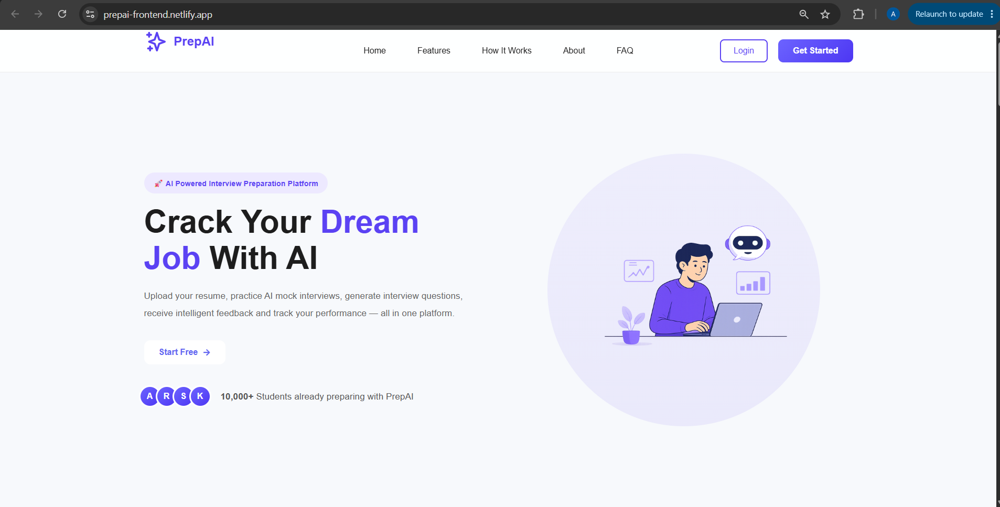
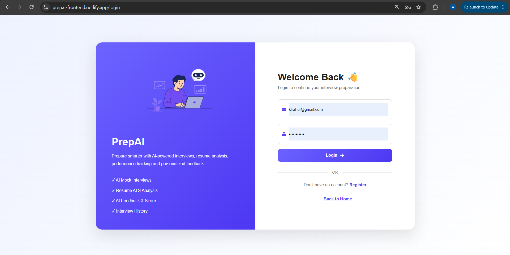
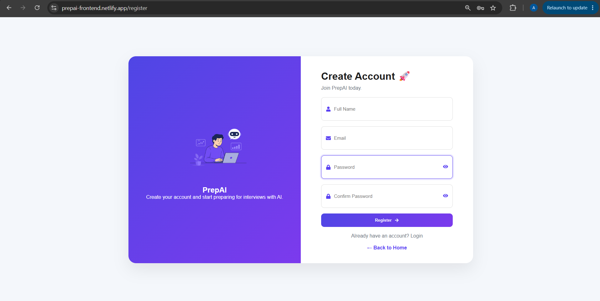
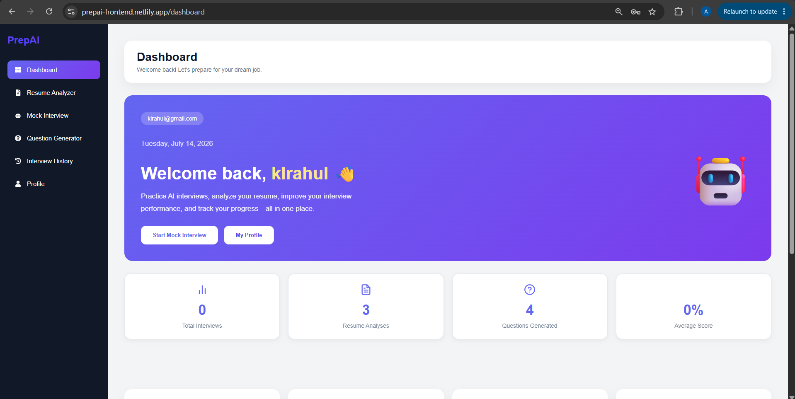
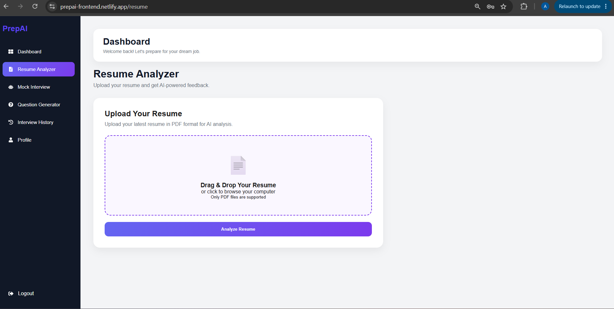
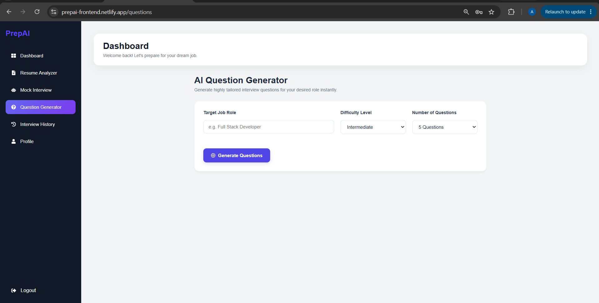
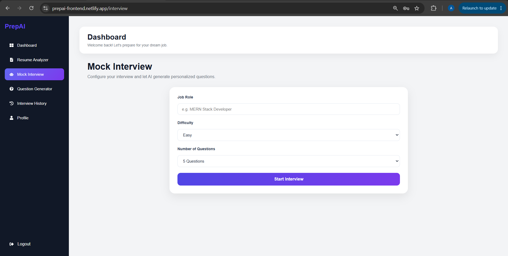
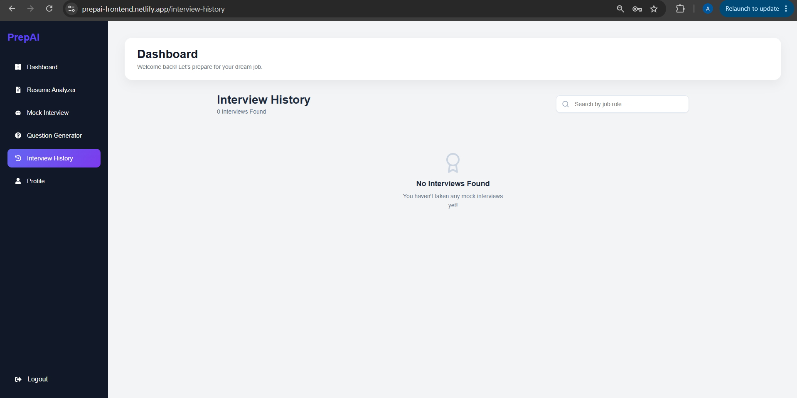

# 🚀 PrepAI

> **AI-Powered Interview Preparation Platform built using the MERN Stack and Groq AI.**

---

## 🌐 Live Demo

**Frontend:**  
https://prepai-frontend.netlify.app

**Backend API:**  
https://prepai-fl6w.onrender.com

**GitHub Repository:**  
https://github.com/amarKamtham/PrepAI

---

> **PrepAI** helps students and job seekers prepare for technical interviews using AI-powered resume analysis, mock interviews, intelligent feedback, and interview question generation.


---

# 📌 Project Overview

PrepAI is an **AI-Powered Interview Preparation Platform** designed to help students, fresh graduates, and job seekers prepare for technical interviews more effectively.

The platform combines **Artificial Intelligence** with the **MERN Stack** to provide a complete interview preparation experience. Users can upload their resumes for AI analysis, generate role-specific interview questions, participate in AI-powered mock interviews, receive detailed feedback with scores, and track their overall performance through a personalized dashboard.

PrepAI follows a **multi-user architecture**, ensuring every user has secure authentication and private access to their own resumes, interview history, generated questions, and dashboard analytics.

---

## 🎯 Problem Statement

Many students struggle to prepare for technical interviews because they lack personalized guidance, realistic interview practice, and detailed feedback on their performance.

PrepAI solves this problem by providing:

- AI-powered Resume Analysis
- AI-generated Interview Questions
- AI-based Mock Interviews
- Personalized Interview Feedback
- Progress Tracking Dashboard

---

## 🎯 Objectives

- Help users improve interview performance.
- Analyze resumes using AI.
- Generate role-based interview questions.
- Conduct AI mock interviews.
- Track interview progress over time.
- Provide an intuitive and modern user experience.
---

# ✨ Features

## 🔐 Authentication

- Secure User Registration
- User Login with JWT Authentication
- Protected Routes
- User Profile Management
- Multi-user Data Isolation

---

## 📄 AI Resume Analyzer

- Upload Resume in PDF Format
- AI-based Resume Analysis
- Resume Score
- Strengths Identification
- Weakness Detection
- Missing Skills Analysis
- AI Improvement Suggestions
- Resume History

---

## 🤖 AI Interview Question Generator

- Generate Role-based Interview Questions
- Multiple Difficulty Levels
- Custom Number of Questions
- Save Generated Questions
- Question History

---

## 🎤 AI Mock Interview

- Practice Technical Interview Questions
- Submit Answers
- AI Evaluation
- AI-generated Feedback
- Interview Score
- Interview History

---

## 📊 Dashboard

- Personalized Dashboard
- User-specific Statistics
- Total Interviews
- Resume Analysis Count
- Questions Generated Count
- Average Interview Score
- Recent Interview Activity
- Performance Overview

---

## 👤 User Profile

- View Profile
- Update Profile Information
- Secure Authentication

---

## ☁️ Deployment

- Frontend hosted on Netlify
- Backend hosted on Render
- MongoDB Atlas Database
- Production-ready MERN Architecture
---

# 🛠️ Tech Stack

| Category | Technologies |
|----------|--------------|
| **Frontend** | React (Vite), React Router, Axios, CSS, React Icons, Recharts |
| **Backend** | Node.js, Express.js |
| **Database** | MongoDB Atlas, Mongoose |
| **Authentication** | JWT, bcryptjs |
| **AI Integration** | Groq API |
| **File Upload** | Multer, pdf-parse |
| **Deployment** | Netlify, Render |
| **Version Control** | Git, GitHub |
| **Development Tools** | VS Code, Postman |

------

# ⚙️ Installation & Local Setup

## 1️⃣ Clone the Repository

```bash
git clone https://github.com/amarKamtham/PrepAI.git
```

Move into the project folder:

```bash
cd PrepAI
```

---

## 2️⃣ Install Backend Dependencies

```bash
cd backend
npm install
```

---

## 3️⃣ Install Frontend Dependencies

Open a new terminal:

```bash
cd frontend
npm install
```

---

## 4️⃣ Configure Environment Variables

### Backend (`backend/.env`)

Create a `.env` file inside the `backend` folder and add:

```env
PORT=5000

MONGO_URI=your_mongodb_connection_string

JWT_SECRET=your_jwt_secret

GROQ_API_KEY=your_groq_api_key
```

---

### Frontend (`frontend/.env`)

Create a `.env` file inside the `frontend` folder:

```env
VITE_API_URL=http://localhost:5000/api
```

---

## 5️⃣ Run the Backend

```bash
cd backend
npm start
```

or

```bash
npm run dev
```

---

## 6️⃣ Run the Frontend

Open another terminal:

```bash
cd frontend
npm run dev
```

---

## 7️⃣ Open the Application

Frontend:

```
http://localhost:5173
```

Backend:

```
http://localhost:5000
```

---

# 📸 Application Screenshots

## 🏠 Landing Page



---

## 🔐 Login Page



---

## 📝 Register Page



---

## 📊 Dashboard



---

## 📄 Resume Analyzer



---

## 🤖 AI Question Generator



---

## 🎤 Mock Interview



---


## 📜 Interview History



---

# 🌍 Deployment

## Live Application

### Frontend (Netlify)

https://prepai-frontend.netlify.app

### Backend (Render)

https://prepai-fl6w.onrender.com

---

# 🏗️ System Architecture

```text
                 User
                   │
                   ▼
        React Frontend (Netlify)
                   │
             Axios REST API
                   │
                   ▼
       Node.js + Express Backend
             (Hosted on Render)
                   │
        ┌──────────┴──────────┐
        ▼                     ▼
 MongoDB Atlas            Groq AI
(Database Storage)      (AI Processing)
```

---

# 🔒 Security Features

- JWT Authentication
- Password Hashing (bcryptjs)
- Protected Routes
- User-specific Data Isolation

---

# 👨‍💻 Author

## Amar Kamtham

Computer Engineering Student

### GitHub

https://github.com/amarKamtham

---

# 🙏 Acknowledgements

This project was built using:

- React
- Node.js
- Express.js
- MongoDB Atlas
- Groq AI
- Render
- Netlify

---

# 📄 License

This project is licensed under the **MIT License**.

---